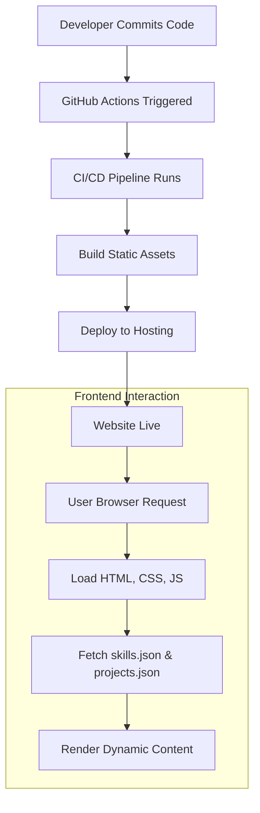

# 🚀 Dynamic Portfolio Website

<p align="center"></p>

## Short Description
Discover `portfolio_website`, a modern, responsive, and visually engaging personal portfolio designed to showcase skills, projects, and professional experience. This project provides a robust foundation for developers and designers to present their work to the world with elegance and interactivity, featuring dedicated sections for project highlights, work experience, and an accessible resume.

## ✨ Key Features
*   **Captivating User Interface:** A clean, modern design with smooth animations and interactive elements powered by JavaScript, including the `particles.js` library for dynamic backgrounds.
*   **Comprehensive Project Showcase:** Dedicated sections to highlight your best work, complete with descriptive details and imagery.
*   **Detailed Experience Timeline:** Professionally present your career journey and academic achievements.
*   **Integrated Resume:** Direct access to your professional resume (PDF) for immediate review by potential employers.
*   **Seamless Continuous Integration/Deployment (CI/CD):** Automated workflows via GitHub Actions ensure your site is always up-to-date with the latest changes upon every commit.
*   **Custom 404 Page:** A branded and user-friendly error page to handle unexpected navigation, enhancing user experience.
*   **Optimized Performance:** Efficiently structured HTML, CSS, and JavaScript for fast loading times and smooth interactions.

## Who is this for?
This portfolio website is meticulously crafted for:
*   **Software Developers & Engineers:** To present their coding projects and technical skills.
*   **Designers & UI/UX Specialists:** To showcase their creative portfolio and design expertise.
*   **Job Seekers:** A professional online presence to impress recruiters and hiring managers.
*   **Freelancers:** To attract new clients by demonstrating a strong body of work.
*   **Students & Graduates:** To build an initial online presence and document their learning journey.

## Technology Stack & Architecture
This project is built with a focus on web standards and modern development practices, ensuring broad compatibility and a smooth user experience.

*   **Frontend Development:**
    *   **HTML5:** Structured and semantic content.
    *   **CSS3:** Styled for responsiveness and visual appeal, utilizing custom properties and advanced selectors.
    *   **JavaScript (Vanilla JS):** Powers interactivity, animations, and dynamic content loading (e.g., `projects.json`, `skills.json`).
    *   **`particles.js`:** For generating engaging, animated backgrounds.
*   **Build & Deployment:**
    *   **GitHub Actions:** Automates testing and deployment (CI/CD pipeline) for efficient updates.
*   **Content Management:**
    *   **JSON Files:** `projects.json` and `skills.json` are used to manage project and skill data, allowing for easy updates without modifying core HTML.

## 📊 Architecture & Database Schema
This project leverages a static site architecture, with content primarily driven by HTML, CSS, and client-side JavaScript, fetching data from local JSON files. Deployment is streamlined through a robust CI/CD pipeline.



## ⚡ Quick Start Guide
Getting this portfolio website up and running is straightforward.

1.  **Clone the repository:**
    ```bash
    git clone https://github.com/premkale4401-lgtm/portfolio_website.git
    cd portfolio_website
    ```
2.  **Open in your browser:**
    Simply open the `index.html` file in your preferred web browser. For local development, consider using a live server extension (like Live Server for VS Code) to ensure all assets load correctly.
    ```bash
    # For VS Code Live Server extension users
    # Right-click index.html and select "Open with Live Server"
    ```
3.  **Customize your content:**
    *   Edit `index.html`, `experience/index.html`, `projects/index.html` to update text, links, and personal information.
    *   Modify `assests/css/style.css` and other CSS files for styling adjustments.
    *   Update `assests/js/script.js` for any custom JavaScript logic.
    *   Populate `projects/projects.json` and `skills.json` with your specific projects and skills.
    *   Replace `assests/resume.pdf` with your own resume file.
    *   Update images in `assests/images/` with your own media.

## 📜 License
This project is released under the [MIT License](LICENSE).